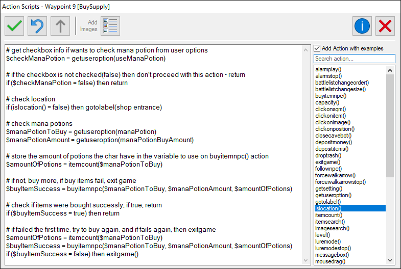

# Definition

The `Action` script code isn't any real programming or scripting language, it is basically text that you write and the bot with its own interpreter, interprets ~~(really?)~~.

That being said, it has its own **syntax**, the way you should and should not write the code for it to work. It was planned to look like/be similar to *Windbot* action scripts, that were written in `lua`, but it still has many different characteristics.

> Since the Action script code is not any of the real programming/scripting language, the interpreter is currently quite simple, so there are a few **limitations** when writing code that a normal language normally doesn't have. It is still a working in progress to enchance and add new possibilities.

*Example of action script code:*




---


# Writing Actions
The Action will be basically written functions with params, you can write `1` function per **line**.

**Examples:**
``` action
gotolabel(Waypoints)
```
``` action
say(hi)
say(mission)
say(yes)
```
``` action
presskey(F12)
clickonsqm(Left, N)
```

---

# Comments

Any line that starts with a hashtag `#` will be considered a comment.

It's not possible to write multi-line comments like it is in other languages with for example `/*` and `*/` symbols, you need to start each line with a `#` to be considered as a comment.

``` action
# messagebox(this is a comment)
messagebox(this is not a comment and will be executed)
# another line of comment, I can write anything here :)
# and in this line too
```

---

# Variables

A variables is used to store(receive) a value that can be used in a function as a parameter.

The action can have its own variables, that will have value only when running that waypoint action. 


## Creating a variable

To create a variable, you needed to write it as `$` and the variable name: `$variableName`. To assign a value to the variable, write the equal `=` signal with one space after the variable name(see the examples).

A variable(currently) **can only receive a function as value**, that means a variable is only used to receive the result of a function. So you **can't** do something like `$var = 100`.

## Using variables

Variables are commonly used in combination with the [`getuseroption()`](cavebot/functions/getuseroption.md) and [`getsetting()`](cavebot/functions/getsetting.md) functions, to get the User settings from the Script Setup(getuseroption) or the bot settings(getsetting).


## Examples

1. Create a variable named **manaPotions**, that will receive the value of the function `itemcount(mana potion)`.
``` action
$manaPotions = itemcount(mana potion)
```

2. Create a variable named **manaPotionSelected**, that will receive the value of the function `getuseroption(manaPotionToUse)`. For better understading of this example below, check the [`getuseroption()`](cavebot/functions/getuseroption.md) documentation.

``` action
$manaPotionSelected = getuseroption(manaPotionToUse)

# buy 100 units of whatever is the mana potion the user selected in the "manaPotionToUse" option in the Script Setup
buyitemnpc($manaPotionSelected, 100)
```

?> **Important:** a variable can also be used to store the **status** of a function.

Every function returns a value when running, the value is in most functions `true` if no error/fail occured, or `false` otherwise.

With that in mind, it can be useful to check if a function failed and do something else in this case, like this:

``` action
# check if the buyitemnpc action fails
$success = buyitemnpc(mana potion, 100)

# if it fails, then exit the game
if ($success = false) then exitgame()
```

---

# Conditions

It's possible to write a condition to run a function, using `if`, `then` and `else` statements.

The `else` statement is **optional** in the condition, since it will always execute the next action script line, unless it reaches a function of `gotolabel` or `return`.

It follows a very simple structure, to write if statement it's like this:<br>
`if`**(** *condition* `<operator>` *value* **)** `then` *function()* `else` *function()*

- `condition:` variable or function;
- `operator:` can be one of these logical operators:
  - equal `=`
  - different `!=`
  - higher `>`
  - lower `<`
  - lower or equal `<=`
  - higher or equal `>=`
- `value:` number, string, binary or variable;
- `function():` the action script function, or it can also be a `return`, a return simply **aborts** the rest of the action script and run the next Waypoint.


## Variables in condition

The `condition` and `value` of the condition statement can be variables aswell, as shown in the examples below:

1. Example with Condition and Value as variables.

``` action
if ($potion < $amount) then gotolabel(leaveHunt)
```

2. In this example, the variable **A_Hour** don't have the `$` symbol because it's a built-in variable of the bot, in this case actually an AutoHotkey variable.

``` action
if (A_Hour = $serverSaveHour) then gotolabel(serverSave)
```

3. Another example with a built-in variable of the bot, using the `posz` variable, that stores the floor level that the char is.

``` action
if (posz = 7) then gotolabel(groundFloor)
```

## Examples

1. Check the amount of **mana potion** and go to a label named `leaveHunt` if have less than `100`.
- `condition:` function
  - itemcount(mana potion)
- `operator:` lower `<`
- `value:` 100

``` action
if (itemcount(mana potion) < 100) then gotolabel(leaveHunt)
```

2. Check the amount of **strong mana potion**, where the amount is a variable(`$amountOfPotions`) from the Script Setup.
<br>If the amount the char already have(`$potionsLeft`) is equal or higher than the `$amountOfPotions`, it will abort the action(`return`), otherwise will run the next script lines to buy more potions.
- `condition:` variable
  - $potionsLeft
- `operator:` equal or higher `>=`
- `value:` variable
  - $amountOfPotions

``` action
$amountOfPotions = getuseroption(healthPotionsToBuy)
$potionsLeft = itemcount(strong mana potion)

if ($potionsLeft >= $amountOfPotions) then return

# buy $amountOfPotions units of strong mana potion, decreasing how many potions the char have ($potionsLeft)
buyitemnpc(strong mana potion, $amountOfPotions, $potionsLeft)
```

---

# Syntax, Rules & Limitations

- It's **not** case sentitive.
- It's **not** possible to use logical operators such as `OR` and `AND`:
  - **Example1:** *if ($var1 = true* `||` *$var2 = true) then function()* 
  - **Example2:** *if ($var1 = true* `&&` *$var2 > 25) then function()* 
- The `if` condition statement must be between paretheses and the *function()* after the `then` :
  - **Example:** `if` **(** *condition statement* **)** `then` *function()*
- Only one(`1`) condition per **line**, the whole if statement must be in the same line(can't put the `else` statement in the next line):
  - **Correct** example: 
    ``` action
	if ($var = true) then gotolabel(varIsTrue) else gotolabel(varIsFalse)
	```
  - **Incorrect** example: 
    ``` action
	if ($var = true) then gotolabel(varIsTrue)
	else gotolabel(varIsFalse)
	```

