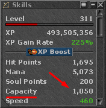

# capacity

<!-- tabs:start -->

#### **English**

Check the character's current capacity(cap).


!> The cap must be visible in the Skills window for it to work.<br><br>


#### **Portuguese**

Checar o capacity atual do char(cap).

!> O cap deve estar visivel na janela de Skills para funcionar.<br><br>


<!-- tabs:end -->

**capacity**()

No Parameters

**Return Value**

Returns the `cap` amount upon success, or `0` otherwise.

---

**Examples**

1. if cap is lower than `50`, go to the waypoint with label named **leavehunt**.

```action
if (capacity() < 50) then gotolabel(leaveHunt)
```
