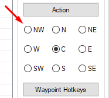

# clickonsqm

<!-- tabs:start -->

#### **English**

Click on one of the SQM around the character(or center).

#### **Portuguese**

Clicar em um dos SQMs em volta do char(ou central).


<!-- tabs:end -->

**clickonsqm**(`click`, `direction`, `repeat*`, `delay*`)


- **Parameters**
  - `click:` **left** or **right**.
  - `direction:` direction of the SQM to click, one of the image below.
  - `repeat:` optional param; times to click, default is 1.
  - `delay:` optional param; the interval delay in **miliseconds** after each click, default is 500.




**Return Value**

Nothing.

---

**Examples**

1. Right click on **North** SQM `3` times, wait `1000`ms after each click.

```action
clickonsqm(Right, N, 3, 1000)
```

