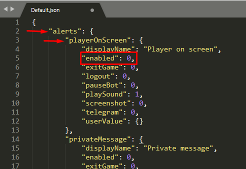

# getsetting

<!-- tabs:start -->

#### **English**

Get the value of a setting from the script JSON and store it in a variable, that can be used in functions and conditions.

#### **Portuguese**

Obter o valor de uma configuração do JSON do script e guardar em uma variável, que pode ser utilizada em funções e condições.

<!-- tabs:end -->


**getsetting**(`setting path`)

- **Parameters**
  - `setting path:` the path of the setting, following the structure of the script json.


**Return Value**

Returns the setting value upon success, or `-1` otherwise.

?> To know what is the setting path of the option you want to check, you must open the script JSON file in any text editor(I recommend *Sublime Text*) and follow its structure.


If I want to check if the **player on screen** alert is enabled, I open the script JSON file and see this:



`alerts` is the main setting, it has other children settings, one of them is `playerOnScreen`, that also has children settings, we want to check the `enabled` setting.

So the path will be `alerts/playerOnScreen/enabled`, and the getsetting function:
```action
$alertEnabled = getsetting(alerts/playerOnScreen/enabled)
if ($alertEnabled = true) then ...
```

---

**Examples**

1. Check if looting is enabled, and enable if it is disabled.

```action
$lootingEnabled = getsetting(looting/settings/lootingEnabled)
if ($lootingEnabled = 0) then setsetting(looting/settings/lootingEnabled, 1)
```


2. Get the **main backpack** selected in `Looting > DepositList` and move up to 10 `great mana potion` stacks to the backpack.

```action
$mainbp = getsetting(looting/depositSettings/backpackSettings/mainBackpack)
mousedragitem(great mana potion, $mainbp, 10, 500)
```
