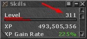

# level

<!-- tabs:start -->

#### **English**

Check the character's current level.


!> The level must be visible in the Skills window for it to work.<br><br>


#### **Portuguese**

Checar o level atual do char.

!> O level deve estar visivel na janela de Skills para funcionar.<br><br>


<!-- tabs:end -->

**level**()

No Parameters

**Return Value**

Returns the `level` upon success, or `0` otherwise.

---

**Examples**

1. if level is higher or equal than `8`, go to the waypoint with label named **leavehunt**.

```action
if (level() >= 8) then gotolabel(leaveHunt)
```
