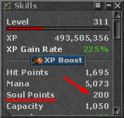

# soulpoints

<!-- tabs:start -->

#### **English**

Check the character's current soulpoints.


!> The soulpoints must be visible in the Skills window for it to work.<br><br>


#### **Portuguese**

Checar o soulpoints atual do char.

!> O soulpoints deve estar visivel na janela de Skills para funcionar.<br><br>


<!-- tabs:end -->

**soulpoints**()

No Parameters

**Return Value**

Returns the `soulpoints` upon success, or `0` otherwise.

---

**Examples**

1. if soulpoints is higher or equal than `10`, go to the waypoint with label named **LowSoul**.

```action
if (soulpoints() < 10) then gotolabel(LowSoul)
```
