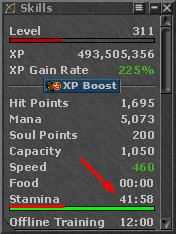

# stamina

<!-- tabs:start -->

#### **English**

Check the character's current **hours** of stamina.


!> The stamina must be visible in the Skills window for it to work.<br><br>


#### **Portuguese**

Checar a quantidade de **horas** de stamina atual do char.

!> O stamina deve estar visivel na janela de Skills para funcionar.<br><br>


<!-- tabs:end -->

**stamina**()

No Parameters

**Return Value**

Returns the `hours` of stamina upon success, or `0` otherwise.

---

**Examples**

1. if stamina is lower than `40` hours, go to the waypoint with label named **leavehunt**.

```action
if (stamina() < 40) then gotolabel(leaveHunt)
```
