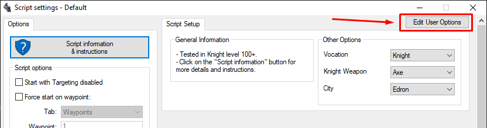
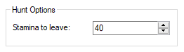
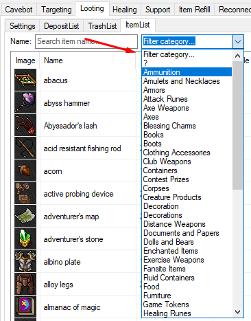

#
# What's a Setup?

The Setup is where the user who downloads your script, or even yourself, will be able to configure the script, to make it suit his needs. You could add options to enable or disable specific hunting areas, specify custom behavior and much more; there are endless possibilities.

> OldBot's setup is almost identical as WindBot's setups, with just a few differences in some properties. If you copy and paste a Windbot setup, it's probably gonna work correctly here aswell.

# How to build a Setup?

To build the setup, we'll have to work with a markup language called `JSON`. If you're not familiar with it, that's cool, take it easy, it's not that hard. Take a look at the code I used to build example below:


```json
[{
	"name": "generalInfo",
	"text": "General Information",
	"children": [
		{
			"rows": 2,
			"text": "- Tested in Knight level 100+.\n- Click on the \"Script information\" button for more details and instructions.",
			"type": "text"
		}
	]
}, {
	"name": "otherOptions",
	"text": "Other Options",
	"column": 2,
	"children": [{
			"type": "combobox",
			"name": "vocation",
			"text": "Vocation",
			"description": "Which vocation should be chosen?",
			"items": ["Knight", "Paladin", "Sorcerer", "Druid"],
			"value": "Knight"
		},
		{
			"type": "combobox",
			"name": "weapon",
			"text": "Knight Weapon",
			"description": "If you chose Knight as vocation, which weapon type should be chosen?",
			"items": ["Axe", "Sword", "Club"],
			"value": "Axe"
		},
		{
			"type": "combobox",
			"name": "city",
			"text": "City",
			"description": "What city should be chosen?",
			"items": ["Ankrahmun", "Edron", "Darashia", "Liberty Bay", "Port Hope", "Ab'Dendriel", "Carlin", "Thais", "Venore"],
			"value": "Edron"
		}
	]
}]

```


## OK, but where to I put that JSON thing?

You put the **JSON** inside a place we call **User Options**, which is just stylish way to say setup. You can find it under Cavebot > **Script Settings** tab, on the top right corner. It's a button named `Edit User Options`.




## OK, but how do I build that JSON thing?

Well, I'm glad you finally learned how to spell it correctly. We shall move on then: the Setup is based on widgets. A widget can be thought of as a setting in the setup. It's a text field, a checkbox, etc... Each widget has its functionality and we'll be going over every single one of them.

I highly recommend you use the [JSON formatter](https://jsonformatter.curiousconcept.com/#) or [JsonLint](https://jsonlint.com/), where you can paste your JSON code and it will format and validate for you in case you screw up something.


---

# Widgets

## Group Widget
This is our main widget. It's inside it that we place all the other widgets.

- **Properties:**
  - `name:` The name of the group box. It must be a **unique** name, no other group box can have the same name atribute.
  - `text:` The title of the group box; if none is provided, name is used.
  - `description:` The description to be displayed on the tooltip when placing the mouse over the widget;
  - `column:` The column the group box should be place on; 1 for first column(left), 2 for second(right.
  - `children:` The widgets the group box will contain.


**Examples:**


```json
{
	"name"     : "groupName",
	"text"     : "Title",
	"children" : []
}
```

---

## Text

A text control only, it's useful to show some information option or warn about something. Use `\n` to break lines in the text field.

- **Properties:**
  - `type:` The widget type; "text" in this case.
  - `text:` The text to be displayed.
  - `row:` Amount of rows reserved for the text, the longer the text is, more rows you will need to set here; default is 1.


**Examples:**


```json
{
	"name": "generalInfo",
	"text": "General Information",
	"children": [
		{
			"rows": 2,
			"text": "- Tested in Knight level 100+.\n- Click on the \"Script information\" button for more details and instructions.",
			"type": "text"
		}
	]
}
```

---

## Line Edit

This is one of the simplest widgets. It's basically a text field, in which you can input any text. It could be used to get the name of a special character, some backpacks for the setup or even a safelist, if handled correctly.

- **Properties:**
  - `type:` The widget type, it can be one of the following:
    - **lineedit**: an alphanumeric input;
    - **number**: a numeric input, with up and down controls;
  - `name:` The name of the widget. It's used to retrieve its current value.
  - `text:` The label to be displayed beside the text field; if none is provided, name is used.
  - `description:` The description to be displayed on the tooltip when placing the mouse over the widget;
  - `value:` The default value for the field.
  <!-- - `placeholder:` The placeholder for the widget. -->

**Examples:**


```json
{
	"name"     : "groupName",
	"text"     : "Cool Title",
	"children" : [
		{
			"type"  : "lineedit",
			"name"  : "yourName",
			"text"  : "Your name here:"
		}
	]
}
```




```json
{
	"name"     : "huntOptions",
	"text"     : "Hunt Options",
	"children" : [
		{
			"type"  : "number",
			"name"  : "staminaToLeave",
			"text"  : "Stamina to leave:",
			"value" : "40"
		}
	]
}
```

---

## Checkbox

This one is pretty simple too. You're probably used to it in most websites/softwares, like on that "remember me" thing. It's useful for simple yes/no questions, like specifying if a special path to the hunt should be taken or if the bot should use a specific hunting strategy.

- **Properties:**
  - `type:` The widget type; "checkbox" in this case.
  - `name:` The name of the widget. It's used to retrieve its current value.
  - `text:` The label to be displayed beside the checkbox; if none is provided, name is used.
  - `description:` The description to be displayed on the tooltip when placing the mouse over the widget;
  - `value:` The default value for the field; 0 or 1 (true/false).


**Examples:**


```json
{
	"name": "generalInfo",
	"text": "General Information",
	"children" : [
		{
			"type"  : "checkbox",
			"name"  : "dostuff",
			"text"  : "Do some stuff?"
		}
	]
}
```


```json
{
	"name": "huntSettings",
	"text": "Hunt Settings",
	"children" : [
		{
			"type"  : "checkbox",
			"name"  : "huntFloor1",
			"text"  : "Hunt floor 1?",
			"value" : 1
		}
	]
}
```

---

## Combobox

This lets you choose an option from a few pre-specified options or a list of ingame items. This is good to let the user choose, let's say, a city as destination, the type of ammunition, potion, or even the backpack used.

- **Properties:**
  - `type:` The widget type; "combobox" in this case.
  - `name:` The name of the widget. It's used to retrieve its current value.
  - `text:` The label to be displayed beside the spinbox; if none is provided, name is used.
  - `description:` The description to be displayed on the tooltip when placing the mouse over the widget;
  - `items:` The list of the pre-specified options, if the filter parameter is present, this list will be ignored.
  - `filter:` This is optional; a list of `categories`(image below) that can be used as filter for the **ItemList**.




**Examples:**

List of `items` with pre-specified options:


```json
{
	"name": "generalInfo",
	"text": "General Information",
	"children" : [
		{
			"type"        : "combobox",
			"name"        : "city",
			"text"        : "City",
			"description" : "What city should be chosen?",
			"items"       : ["Ankrahmun", "Edron", "Darashia", "Liberty Bay", "Port Hope", "Ab'Dendriel", "Carlin", "Thais", "Venore"],
			"value"       : "Ankrahmun"

		}
	]
}
```


`filter` parameter as **potion**, it's a custom filter that only show the potions - in this case we don't use the `items` param:


```json
{
	"name": "potionSettings",
	"text"     : "Potion Settings",
	"children" : [
		{
			"type"        : "combobox",
			"name"        : "potion",
			"text"        : "Mana Potion",
			"description" : "Which mana potion you will use?",
			"filter"      : "potion",
			"value"       : "strong mana potion"
		}
	]
}
```


`filter` parameter as a **list** of categories for Paladin weapons, you can add as many categories you want in the filter list - in this case we don't use the `items` param:


```json
{
	"name": "paladinSettings",
	"text"     : "Paladin Settings",
	"children" : [
		{
			"type"        : "combobox",
			"name"        : "distanceWeapon",
			"text"        : "Distance weapon",
			"description" : "Which distance weapon you will use?",
			"filter"      : ["Ammunition", "Distance Weapons"],
			"value"       : "assassin star"
		}
	]
}
```

---

# How do I read those values?

To read the widgets' values, we'll be using the `getuseroption` function. For more details of how this action works, read the getuseroption documentation.

``` action
$huntFloorOne = getuseroption(huntFloor1)

if ($huntFloorOne = true) then gotolabel(floorOne)
```
