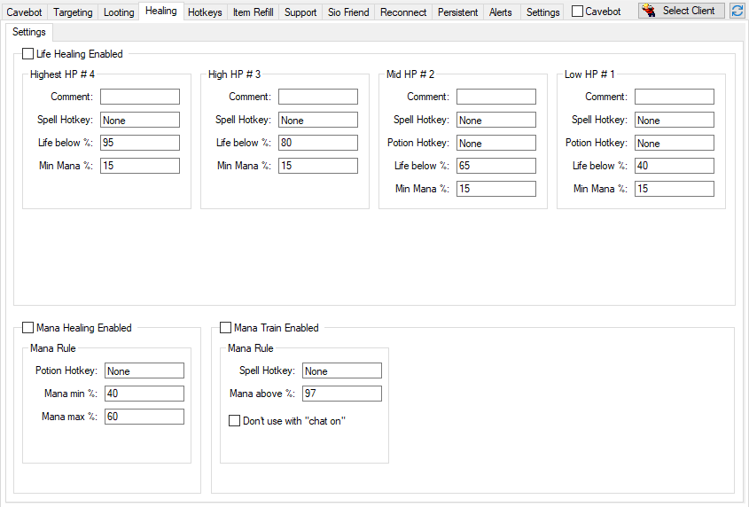

# Description

Healing is used to heal your character automatically with instant spells, potions or runes.

?> Video Tutorial *(Portuguese)*: https://www.youtube.com/watch?v=uoNq8nodjYg

# Interface

Image of version `v10.1`.

---

# Main Functions

## Life Healing
You can setup up to `4` healing rules for Life Healing, where the `LowHP` has the highest priority(it's the first rule to be checked always) and is obligatory to fill one of the hotkeys.

In `LowHP` and `MidHP` you have the option to use `2` hotkeys at once, the **Spell Hotkey** and **Potion Hotkey**, you must fill **at least one** to be able to use the healing. The 2 hotkeys can be used to combo a healing spell with a potion, for example **exura ico** + **health potion**.

- **Options:**
  - `Comment:` A comment or description of the healing rule, for information purpose only.
  - `Spell Hotkey:` Hotkey of the healing spell, **do not** use a potion in the spell hotkey because it can mess the functioning of the healing, since potions and spells have different functioning delays.
  - `Potion Hotkey:` Hotkey of some Health Potion to heal use simultaneously with the *Spell*. The Potion won't consider the `Min Mana` rule to be used, only the Spell will.
  - `Life below %:` Percentage of life to start healing with this rule.
  - `Min mana %:` Mininum percentage of mana the character must have to heal with the spell, if mana is below the spell won't be casted.

---

## Mana Healing
Heal your mana using Mana Potions.

- **Options:**
  - `Potion Hotkey:` Hotkey of the Mana Potion to use.
  - `Min mana %:` Percentage of mana to **start** healing.
  - `Max mana %:` Percentage of mana to **stop** healing.

---

## Mana Train
Cast a spell when your mana is above a percentage, usually used for [Magic Level](https://tibia.fandom.com/wiki/Magic_Level) training.

- **Options:**
  - `Spell Hotkey:` Hotkey of the spell to waste your mana.
  - `Min above %:` Percentage of mana to **start** casting the spell.
  - `Don't use with chat on:` Useful to not cast the spell when you are typing(with *"Chat on"* in Tibia).

?> To avoid misconfiguration, the `Min above %` option can not be set **lower** than Mana Healing's `Min mana %`, it also can't be lower than **20%**.
