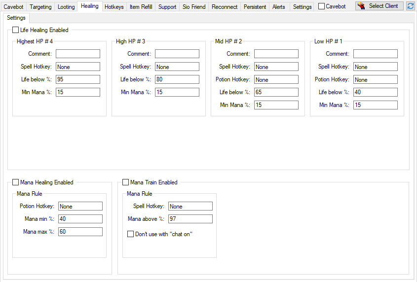

# Description

<!-- tabs:start -->

#### **English**

Healing is used to heal your character automatically with instant spells, potions or runes.

**Interface**

All images are from version `v10.1`.

#### **Portuguese**

Healing é utilizado para healar o seu personagem automaticamente com magias instantânteas, poções ou runas.

?> Video Tutorial: https://www.youtube.com/watch?v=uoNq8nodjYg

**Interface**

Todas as images são da versão `v10.1`.

<!-- tabs:end -->
