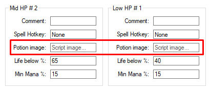

# Life Healing

<!-- tabs:start -->

#### **English**

You can setup up to `4` healing rules for Life Healing, where the `LowHP` has the highest priority(it's always the first rule to be checked) and is obligatory to fill one of the hotkeys of this rule.

In `LowHP` and `MidHP` you have the option to use `2` hotkeys at once, the **Spell Hotkey** and **Potion Hotkey**, you must fill **at least one** to be able to use the healing. The 2 hotkeys can be used to combo a healing spell with a potion, for example **exura ico** + **health potion**.

- **Options:**
  - `Comment:` A comment or description of the healing rule, for information purpose only.
  - `Spell Hotkey:` Hotkey of the healing spell, **do not** use a potion in the spell hotkey because it can mess the functioning of the healing, since potions and spells have different functioning delays.
  - `Potion Hotkey:` Hotkey of some Health Potion to heal use simultaneously with the *Spell*. The Potion won't consider the `Min Mana` rule to be used, only the Spell will.
  - `Life below %:` Percentage of life to start healing with the rule.
  - `Min mana %:` Mininum percentage of mana the character must have to heal with the spell, if mana is below the spell won't be casted.
  - `Potion Image*:` This option will appear in the place of `Potion Hotkey` on clients which is not possible to use items with hotkey(old tibia). In this option, must be filled the name of an image added in the **Script Images** to be used for healing(click on the item and on the character).

  

#### **Portuguese**

Você pode configurar até `4` regras de healing para o Life Healing, onde o `LowHP` tem a maior priodidade(é sempre a primeira regra a ser checada) e é obrigatório preencher uma das hotkeys dessa regra.

No `LowHP` e `MidHP` você tem a opção de usar `2` hotkeys de uma vez só, a **Spell Hotkey** e **Potion Hotkey**, você deve preencher **pelo menos uma** para poder usar o healing. As 2 hotkeys podem ser usadas para compar o healing spell com a potion, por exemplo **exura ico** + **health potion**.

- **Options:**
  - `Comment:` Um comentário ou descrição da regra de healing, para fins de informações somente.
  - `Spell Hotkey:` Hotkey da magia de healing, **não** use uma potion na spell hotkey porque pode atrapalhar o funcionamento do healing, pois potions e spells tem diferentes delays de funcionamento.
  - `Potion Hotkey:` Hotkey de alguma Health Potion para usar simultaneamente com a *Spell*. A Potion não considerará a regra de `Min Mana` para ser usada, somente a magia irá.
  - `Life below %:` Porcentagem de vida para começar a healar a essa regra.
  - `Min mana %:` Porcentagem mínima de mana o personagem deve ter para healar com a magia, se a mana estiver abaixo a magia não será usada.
  - `Potion Image*:` Essa opção aparecerá no lugar da `Potion Hotkey` em clientes em que não é possível usar itens com hotkey(old tibia). Nessa opção, deve ser preenchido o nome de uma imagem adicionada manualmente no **Script Images** para ser usada para o healing(usar o item e clicar no personagem).

  

  
<!-- tabs:end -->
