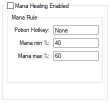

# Mana Healing

<!-- tabs:start -->

#### **English**

Heal your mana using Mana Potions.

- **Options:**
  - `Potion Hotkey:` Hotkey of the Mana Potion to use.
  - `Min mana %:` Percentage of mana to **start** healing.
  - `Max mana %:` Percentage of mana to **stop** healing.
  - `Potion Image*:` This option will appear in the place of `Potion Hotkey` on clients which is not possible to use items with hotkey(old tibia). In this option, must be filled the name of an image added in the **Script Images** to be used for healing(click on the item and on the character).

  

#### **Portuguese**

Healar a sua mana usando Mana Potions.

- **Options:**
  - `Potion Hotkey:` Hotkey da mana potion para usar.
  - `Min mana %:` Porcentagem de mana para **começar** a healar.
  - `Max mana %:` Porcentagem de mana para **parar** de healar.
  - `Potion Image*:` Essa opção aparecerá no lugar da `Potion Hotkey` em clientes em que não é possível usar itens com hotkey(old tibia). Nessa opção, deve ser preenchido o nome de uma imagem adicionada manualmente no **Script Images** para ser usada para o healing(usar o item e clicar no personagem).

  

<!-- tabs:end -->
