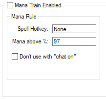

# Mana Train

<!-- tabs:start -->

#### **English**

Cast a spell when your mana is above a percentage, usually used for [Magic Level](https://tibia.fandom.com/wiki/Magic_Level) training.

- **Options:**
  - `Spell Hotkey:` Hotkey of the spell to waste your mana.
  - `Mana above %:` Percentage of mana to **start** casting the spell.
  - `Don't use with chat on:` Useful to not cast the spell when you are typing(with *"Chat on"* in Tibia).

?> To avoid misconfiguration, the `Mana above %` option can not be set **lower** than Mana Healing's `Min mana %`, it also can't be lower than **20%**.

#### **Portuguese**

Usar uma magia quando a sua mana estiver acima da porcentagem, geralmente utilizado para treino de [Magic Level](https://tibia.fandom.com/wiki/Magic_Level).

- **Options:**
  - `Spell Hotkey:` Hotkey da magia para gastar sua mana.
  - `Mana above %:` Porcentagem da mana para **começar** a lançar a magia.
  - `Don't use with chat on:` Útil para não usar a magia quando você está digitando(com *"Chat on"* no Tibia).

?> Para evitar configurações erradas, o `Mana above %` não pode ser setado **menor que** o `Min mana %` do Mana Healing, também não pode ser menor que **20%**.

<!-- tabs:end -->
